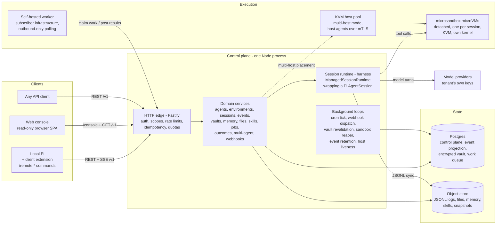
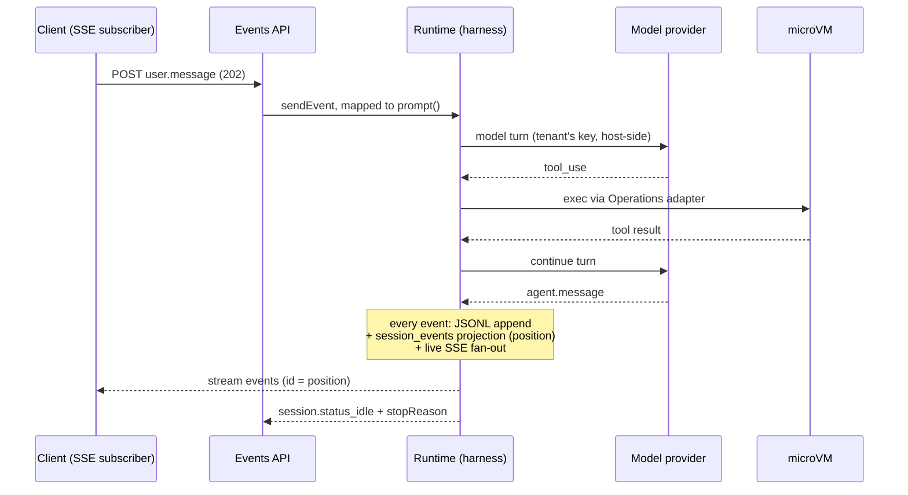

# Architecture — Pi Managed Backend

> **How to read this document.** It is layered: each section zooms into the one before
> it, and no section introduces a concept the previous section hasn't already named and
> placed. Stop whenever you have the resolution you need — §1 is a two-minute read, §2
> is the complete system in one sitting, §3+ are progressively deeper reference.
>
> **Authority.** This document describes the **implemented** system.
> [`docs/spec/spec.md`](spec/spec.md) remains authoritative for *feature behavior*
> (cited as `§x.y` throughout the codebase); [`docs/api-reference.md`](api-reference.md)
> is the pinned wire contract. Where this document and those disagree, they win and this
> document has a bug.

---

## 1. Executive summary

The Pi Managed Backend is a **self-deployable service that gives the
[Pi coding agent](https://github.com/earendil-works/pi-coding-agent) managed-agent
capabilities**: remote agent sessions, scheduled jobs, durable state, sandboxed
execution in microVMs, and a client extension that makes it all feel native to a local
Pi user. It is one Node.js process in front of Postgres and an object store, adapting
the *concepts* of managed agents (agents, sessions, environments, events, memory,
outcomes, multi-agent orchestration) to Pi-native idioms rather than mirroring any
other vendor's API.

Four decisions carry the whole design:

1. **Wrap Pi, never reimplement it** (spec §5). Pi already embodies the triad the
   system needs — the *Session* (a durable, append-only JSONL log), the *Harness* (a
   stateless `AgentSession` that can always be rebuilt from that log), and the
   *Sandbox* (disposable execution). The backend composes Pi's SDK around those three
   seams; it forks nothing.
2. **The session log is the source of truth, not the database** (spec §28). The
   conversation lives only in Pi's JSONL tree — written to local disk, synced to the
   object store. Postgres holds metadata, an append-only event *projection* for
   streaming/replay, and control-plane state. Any harness can be killed and rebuilt
   from the log at any time; that single property is what makes crash recovery,
   cold-wake, forking, and the process pool all cheap.
3. **Secrets never cross the port surface** (spec §25.5). Every internal interface
   carries only opaque `SecretBinding` references; real credential values are resolved
   host-side, inside the sandbox provider or the MCP proxy. Neither the harness nor
   the guest VM can ever see a tenant credential. The one audited exception is the
   tenant's own model-provider key, held in-memory by the harness solely to call the
   model — and a session whose key can't be resolved **fails closed** before any model
   call.
4. **Fail closed, everywhere.** Invalid config aborts boot; a missing vault key
   refuses to start; multi-host mode refuses to boot without per-host tokens + mTLS;
   worker keys are deny-by-default outside their three routes; CI gates hard-fail when
   the infrastructure they need is missing instead of skipping green.

---

## 2. The system at a glance

This section is the entire system at coarse resolution: everything is named and
placed, nothing is specified. Every deeper section expands something introduced here.

### 2.1 One picture



### 2.2 The life of one delegated task

A user in their local Pi types `/remote:delegate "run the test suite and report
failures"`. Everything the system is shows up in what happens next.

The **client extension** (`@pi-managed/client`, loaded into local Pi) holds a
tenant-scoped **API key** and calls the backend's versioned REST API. Every resource it
touches belongs to a **tenant** — the organization scope derived from the key, never
supplied by the client. The key carries **scopes** (`read`, `write`, `admin`); the
request passes bearer auth, per-tenant rate limits, quota checks, and carries an
**idempotency key** so retries are safe.

The delegation creates a **session** — the central resource: one running instance of an
**agent** (a versioned definition of behavior: model, system prompt, tools, skills, MCP
servers) inside an **environment** (a sandbox configuration: image, resources, network
policy). Creation is deliberately lazy: the session starts `idle`, and no VM exists
yet.

The first `user.message` **event** arrives and the session wakes. The **session
manager** builds a harness — a `ManagedSessionRuntime` wrapping a real Pi
`AgentSession` bound to the session's durable **JSONL log**. Waking pulls everything
the session was configured with: the tenant's model-provider key is decrypted from the
**vault** (fail-closed — no key, no session), other credentials become opaque bindings
the guest sees only as `$MSB_…` placeholders, **memory stores** are mounted at
`/mnt/memory/<slug>/`, **skills** are staged into the workspace, and a **sandbox** — a
microsandbox microVM with its own kernel, named `t<tenant>-s<session>` — is
provisioned. The VM runs *detached* from the backend process, so a backend restart
doesn't kill it.

The turn runs. The harness calls the model from the host; every built-in tool call
(`bash`, `read`, `write`, …) executes **inside the microVM** through an operations
adapter — untrusted agent code never touches the backend host. Each step becomes an
event (`agent.thinking`, `agent.tool_use`, `agent.tool_result`, `agent.message`),
appended to the JSONL log, persisted to a Postgres **event projection** that assigns
each event its permanent position, and streamed to subscribers over **SSE** — which is
what the extension's live-view panel is rendering back in local Pi. A client that
disconnects replays from its last position, gap-free. Token **usage** is metered
per-turn against an optional per-session **budget**; exhausting it stops the session
with `stopReason: budget_exhausted`.

The agent writes its deliverables to `/mnt/session/outputs/` and the session settles
back to `idle` with a stop reason. The JSONL log syncs to the **object store** (it also
syncs every ~30 s while running). After the idle timeout, the backend checkpoints the
VM — filesystem preserved, processes not. A later message cold-wakes the whole stack:
rebuild the harness from the log, restart or re-provision the VM, resume. The user
fetches the outputs — or just reads the completion notice the extension surfaces.

**The same machinery, entered differently:**

- A **scheduled job** (cron) is a stored session recipe plus a schedule; an in-process
  scheduler ticks every minute and fires each due occurrence **exactly once** (enforced
  by a Postgres unique constraint, so restarts and replicas can't double-fire). Each
  firing creates a normal session; each attempt is recorded as a **job run**. One-shot
  jobs are the delegation mechanism itself.
- A **self-hosted environment** replaces the microVM with the subscriber's own
  infrastructure: the backend enqueues tool calls on a Postgres **work queue**; a
  **worker** (shipped in `packages/worker`) polls with a narrowly-scoped **worker
  key**, executes locally, and posts results back as events. Outbound HTTPS only — the
  worker never listens.
- An **outcome** attaches a rubric to the session; a separate **grader** agent (own
  context window) evaluates `/mnt/session/outputs/` each iteration until the rubric is
  satisfied or iterations run out. A **multi-agent** session gives a coordinator agent
  a roster of subagents, each in its own context-isolated **thread**. **Goals** keep a
  session self-continuing across turns; **tasks** are its per-session todo list.
- **Webhooks** push thin signed notifications (`type` + `id`) to registered URLs on
  lifecycle events. The **web console** is a read-only browser SPA served by the
  backend itself at `/console`. **Files** are independently uploaded resources;
  **custom tools** let the caller's own code execute a tool and post the result back;
  **permission policies** can force per-tool confirmation, pausing the session with
  `requires_action` until the user answers.

### 2.3 Concept inventory

Every noun in the system. If a concept exists and is not in this table, this section
has a bug. (Expanded in the linked sections; wire shapes in
[`api-reference.md`](api-reference.md), storage in [`db-schema.md`](db-schema.md).)

| Concept | One line | More |
|---|---|---|
| Tenant | Organization scope; owns every resource; derived from the API key, never client-supplied | §6.1 |
| API key | Tenant-scoped bearer credential, argon2id-hashed, shown once; carries scopes `read`/`write`/`admin` | §6.2 |
| Worker key | API key scoped `self_hosted_worker:<envId>`; valid only for the three work-queue routes | §5.4 |
| Agent | Versioned definition of behavior (model, prompt, tools, skills, MCP servers, roster); not a process | §2.2 |
| Agent version | Immutable config snapshot; `PATCH` creates the next one | [api-ref](api-reference.md) |
| Environment | Sandbox configuration: `cloud` or `self_hosted`, image, resources, network policy | §2.2 |
| Session | The central resource: one agent running in one environment; DB row + JSONL log + sandbox handle | §5.1 |
| Session JSONL log | Pi's durable append-only tree log — the conversation's single source of truth | §5.1, §6.3 |
| Harness / `AgentSession` | The in-process "brain" (Pi SDK object wrapped by `ManagedSessionRuntime`); rebuilt from the log on wake | §4.2, §5.1 |
| Sandbox | Per-session detached microsandbox microVM — the disposable "hands" where tools execute | §5.1 |
| Snapshot | Filesystem-only VM snapshot (no live RAM); pre-warm or fork | spec §10.3 |
| Event | Inbound `user.*`/`system.*`, outbound `session.*`/`agent.*`/`span.*`; persisted and streamed | §5.2 |
| Event projection | Append-only `session_events` table; the numbering + durability authority for SSE replay | §5.2 |
| Session fork | New session sharing the JSONL tree up to the fork point (tree fork, not a copy) | spec §8.3 |
| Session thread | Context-isolated event stream for a subagent in a multi-agent session | spec §18 |
| Vault | Tenant-scoped credential collection, AES-256-GCM at rest, referenced by ID at session creation | §5.5, §6.2 |
| Credential | One vault secret: `mcp_oauth`, `static_bearer`, `environment_variable`, or `model_provider_key`; write-only fields | §5.5 |
| Secret binding | Opaque placeholder + credential ref — the only credential form that crosses internal interfaces | §3.2, §6.2 |
| Memory store / memory / version | Cross-session text documents mounted at `/mnt/memory/<slug>/`; every mutation makes an immutable version | spec §13 |
| File | Independently uploaded resource (Files API), referenced by ID | spec §21 |
| Skill | Pi Agent-Skills bundle (pre-built or uploaded), staged into the session workspace | spec §20 |
| Scheduled job / job run | Cron- (or once-) triggered session recipe / the record of one trigger attempt | §5.3 |
| Task | Per-session todo item, stored branching-correct in tool results | spec §14 |
| Goal | Durable objective driving autonomous continuation until done/blocked/paused | spec §15 |
| Outcome / grader / rubric | Self-evaluation loop: rubric-guided grading by a dedicated grader agent | spec §16 |
| Multi-agent roster / coordinator | Subagent lineup on an agent / the primary-thread agent that delegates (depth 1) | spec §18 |
| MCP server declaration | Remote MCP server on an agent; auth injected by the backend proxy, never visible to the model | spec §19 |
| Custom tool | Tool executed by the *caller's* code: `agent.custom_tool_use` → `user.custom_tool_result` | spec §11.2 |
| Permission policy | Per-tool `always_allow` / `always_ask` (pause for confirmation) / `always_deny` | spec §22 |
| Budget / usage | Optional per-session hard caps (`maxTokens`/`maxUsd`) / cumulative token + USD accounting | §5.1, spec §9.7 |
| Quota | Per-tenant resource ceilings (sessions, jobs, storage, monthly spend) tied to plans | §6.1 |
| Webhook | Registered HTTPS endpoint receiving thin HMAC-signed lifecycle notifications, at-least-once | spec §23 |
| Work queue / work item / worker | Postgres queue of tool calls for `self_hosted` environments / the subscriber process draining it | §5.4 |
| Idempotency key | Client header on mutating POSTs; 24 h byte-for-byte replay, conflict on reuse with a new body | [api-ref](api-reference.md) |
| Sandbox host / host agent | A KVM machine in the multi-host pool / its authenticated per-host control API | §4.4 |
| Client extension | `@pi-managed/client` — `/remote:*` commands, `remote_*` tools, live-view panel in local Pi | §4.1 |
| Web console | Read-only vanilla-JS SPA served at `/console` | §4.1 |

---

## 3. Containers, packages, and deployment shapes

### 3.1 Runtime processes

| Process | What it is | Talks to |
|---|---|---|
| **Control plane** | The single Node process (`packages/backend/dist/main.js`): HTTP edge, domain, harnesses (default), background loops | Postgres, object store, microVMs, model providers |
| **Session workers** (optional) | `SESSION_WORKER_MODE=pool`: N bounded child processes hosting the harnesses, sharded by session id | Own Postgres pool, own sandbox provider; IPC to parent for live streaming |
| **microVMs** | One detached microsandbox VM per active cloud session | Controlled by the sandbox provider; egress per network policy |
| **Host agents** (multi-host) | Per-KVM-host HTTPS server wrapping that host's local sandbox provider | Control plane only, bearer token + mutual TLS |
| **Self-hosted worker** | Subscriber-run CLI (`pi-managed-worker`); poll or webhook-wake modes | Backend REST only, outbound HTTPS, never listens |
| **Local Pi** | The user's own Pi process with the client extension loaded | Backend REST + SSE |
| **Browser** | The web console SPA | `GET /console` assets + read-only `/v1` calls |

State: **Postgres 16** (control plane; migrations run forward-only on boot), the
**object store** (local filesystem by default, any S3-compatible store; JSONL, files,
memory, skills, snapshots), and **local disk** (`PI_SESSION_LOCAL_DIR`, the per-session
JSONL write path — deliberately durable, not `/tmp`).

### 3.2 Workspace packages

| Package | Runtime shape | Role |
|---|---|---|
| `backend` | The service process | Everything in §4–§6 |
| `contracts` | Library (zod + types) | **The synchronization artifact**: schemas mirror `api-reference.md` 1:1; consumed by backend and client extension; golden tests enforce write-only-secret invariants |
| `client-extension` | Pi extension (in-process with local Pi) | Commands, tools, live view; API key kept in Pi's AuthStorage, settings hold only a reference |
| `worker` | Standalone CLI | Deliberately **zero-dependency** — wire shapes re-declared locally so subscriber infrastructure never depends on backend internals |
| `web-console` | Static browser SPA | No framework, no deps; backend serves its `dist/` at `/console` (same origin, so no CORS) |
| `testkit` | Test-time library | A fake per port + published conformance kits; depends on `backend` for port *types*; backend uses it only as a devDependency |

Two deliberate wrinkles: the `testkit`↔`backend` relationship looks circular but is
acyclic (types one way, devDependency the other), and the worker's isolation means the
work-item shape exists in two places that must be kept in sync by hand.

### 3.3 Deployment shapes

1. **Single-host self-hosted (v1 default):** one process, one implicit tenant, local
   filesystem object store, KVM on the same host. Tenant context still flows through
   every request, so growing up is config, not rewrite.
2. **Multi-host sandbox pool:** `SANDBOX_MODE=multi` — Postgres-registered KVM hosts,
   least-loaded placement, per-host token + mTLS, liveness probing
   ([multi-host design](spec/multi-host-design.md)).
3. **Multi-tenant SaaS:** onboarding enabled, S3 object store, per-tenant quotas/plans,
   billing sink webhooks.

Config is env-var driven (env > config file > defaults), validated at boot, fatal on
error. Full variable list and operational detail: [`deploy.md`](deploy.md). Capacity
reality (measured): an idle woken session costs ~76 MiB (≈70 MiB VM supervisor +
≈5 MiB control plane); the guest ceiling (512 MiB default) is the worst case — see
[`capacity.md`](capacity.md).

---

## 4. Inside the backend

### 4.1 Layers

```
src/api            HTTP edge: one Fastify plugin per resource + middleware
src/domain         business logic, one directory per subsystem; ports.ts is the seam file
src/infra          adapters: config, db, objectstore, sandbox, sandbox-host-pool, telemetry
src/plugins        PluginRegistry: boot-time port overrides
src/pi-extensions  managed features injected INTO each Pi AgentSession
```

The dependency rules that actually hold (verified from imports, not aspiration):

- `api` → `domain` + `infra`. `domain` never imports `api` (one audited exception:
  `domain/self-hosted/routes.ts` registers its own routes and borrows the scope guard).
- `infra` implements the ports declared in `domain/ports.ts` (`MicrosandboxProvider`,
  `MultiHostSandboxProvider`, the object stores).
- Nothing imports `server.ts`/`app.ts` except `main.ts` and tests.
- **Honest caveat:** this is not strict hexagonal. Postgres is *not* behind a port —
  ~60 domain modules use `infra/db` (`Pool`, `tenantScopedQuery`) directly, by design
  (auditable explicit SQL beats an ORM for tenant isolation, per
  [`CONVENTIONS.md`](../CONVENTIONS.md)). Domain also calls `infra/telemetry`
  conventions directly.

### 4.2 The ports

The seams that *are* abstracted exist so subsystems could be built in parallel against
fakes and so deployments can swap implementations. Authoritative contract:
`domain/ports.ts`; reviewer map: [`internal-contracts.md`](internal-contracts.md);
third-party implementations: [`plugins.md`](plugins.md).

| Port | Abstraction | Default impl |
|---|---|---|
| `SandboxProvider` | provision/exec/stop/start/snapshot/destroy/re-attach a sandbox | `MicrosandboxProvider` (or `MultiHostSandboxProvider`) |
| `SessionRuntime` | the harness: wake/sendEvent/subscribe/interrupt/getEntries/status | `ManagedSessionRuntime` (or `RemoteSessionRuntime` proxy in pool mode) |
| `SecretStore` | resolve a session's credentials **as opaque bindings only** | Postgres vault |
| `ProviderKeyResolver` | the sole port returning a raw credential: the tenant's model keys, host-side, fail-closed | vault-backed |
| `ObjectStore` | streaming put/get, etag-conditional put, versioning | filesystem / S3 |
| `UsageRecorder` | token/cost recording, budget checks, tenant rollups | Postgres |
| `Clock` / `Scheduler` | injectable time + cron tick (deterministic DST tests) | wall clock / `CronScheduler` |
| `WebhookSink` | enqueue a thin lifecycle event | persisted dispatcher queue |

Every port has a fake in `@pi-managed/testkit`; `SandboxProvider`, `ObjectStore`, and
`SecretStore` also have published conformance kits that real and third-party
implementations must pass.

### 4.3 Composition root

`main.ts` → `createManagedApp` (`app.ts`) → `createApp` (`server.ts`). Construction
order is load-bearing: config (fatal on invalid) → telemetry init (before any
instrumented code) → billing sink (fails boot before a pool can leak) → Postgres pool
(bounded, statement timeouts) → **migrations up** → object store → sandbox provider →
session-manager collaborators (+ worker pool if configured) → **boot-time VM re-attach**
→ route mounting → background loops. For each pluggable port the precedence is: direct
option override (tests) → `PluginRegistry` factory → config-derived default.

`server.ts` is **the one HTTP edge**: domain code throws `ApiError`
(`domain/errors.ts`, status + machine-readable code, no HTTP imports); the global
Fastify error handler is the only code that renders an error envelope. This convention
is binding — see [`CONVENTIONS.md`](../CONVENTIONS.md).

### 4.4 The sandbox providers

`SANDBOX_RUNTIME=disabled` → no provider (API-only; wake fails).
`single` (default when enabled) → `MicrosandboxProvider` over the pinned
`microsandbox@0.6.6` NAPI SDK: detached tenant-labeled VMs, compiled network policies
(`unrestricted` = microsandbox's public-only preset, **not** allow-all; `limited` =
default-deny + explicit hosts), host-side secret resolution.
`multi` → `MultiHostSandboxProvider`: Postgres host registry, least-loaded placement,
every operation routed to the owning host's **host agent** (bearer token per host +
mutual TLS, constant-time comparison, no unauthenticated endpoints — `/healthz`
included), liveness monitor pulling failed hosts from rotation, cross-host re-attach
with placement-table reconciliation. Design note:
[`spec/multi-host-design.md`](spec/multi-host-design.md).

### 4.5 pi-extensions

Managed features are implemented *as Pi extensions loaded into each `AgentSession`*,
not as forks of Pi: `permission-gate` (hooks `tool_call`, blocks `always_ask` tools on
user confirmation), `mcp-bridge` (routes MCP calls through the credential proxy),
`custom-tools` (relay to client-executed tools + cross-thread cross-posting),
`subagent` (multi-agent delegation, depth 1 enforced by children not loading it),
`tasks`, and `goals`.

---

## 5. Runtime views

The flows that explain the system. Static structure above; behavior here.

### 5.1 Session lifecycle

States: `idle → running → rescheduling → terminated` (3 retries, exponential backoff).
Sessions are born `idle` with **no VM** — the first `user.message` pays the wake cost.

**Wake** (`SessionManager.getOrCreate` → `ManagedSessionRuntime.wake`): load the
session row → ensure the sandbox is running (re-attach a surviving VM by label, restart
a checkpointed one, or provision fresh from the environment's compiled spec) → resolve
model-provider keys (fail-closed) → resolve secret bindings (opaque refs) → mount
memory stores → stage skills → build the Pi `AgentSession` on the existing JSONL with
the managed extensions → start per-session timers (idle policy, crash polling, JSONL
sync). Concurrent wakes of the same session share one in-flight promise; a cap
(`PI_MAX_RUNTIMES`, LRU) evicts only idle runtimes.

**Turn:**



**Sleep / resume:** after `idleTimeout` the idle policy checkpoints the VM (filesystem
kept, processes gone — surfaced to the model in resume context). A new message restarts
it. **Crash recovery:** VM crash is detected by status polling and the VM transparently
replaced; harness crash costs nothing durable — rebuild from JSONL. **Budget:**
enforced per turn; exhaustion interrupts to `idle`/`budget_exhausted`. Blocking pauses
(`requires_action`): custom tools and `always_ask` confirmations idle the session until
the answering `user.*` event arrives.

### 5.2 Events, projection, and SSE

The `session_events` projection is the **single numbering and durability authority**:
the position stamped on a live SSE frame *is* the position the append assigned. Live
subscribers get a bounded per-subscriber stream (overflow drops oldest and emits
`session.stream_lagged`); reconnecting with `Last-Event-ID` replays from Postgres,
gap-free — the same path a fresh subscriber uses from position 0. Reads **never wake**
a session (R4.4): history comes from the projection; only the advance path
(`POST /events`) may boot a VM. Optional live text deltas exist on the wire but are
never persisted or replayed.

### 5.3 Scheduled jobs

An in-process loop ticks every 60 s (+jitter): match due jobs (POSIX cron, literal
wall-clock DST semantics — spring-forward skips, fall-back double-fires), then claim
each occurrence with `INSERT INTO job_runs … ON CONFLICT (job_id, scheduled_at) DO
NOTHING` — **exactly-once across restarts and replicas by unique constraint, not by
memory**. Claimed-but-untriggered rows are re-fired by a lease-based recovery scan at
the start of each tick. Missed occurrences within a 5-minute window catch up; older
ones are recorded as skipped. Trigger-time failures (archived agent/environment,
missing vault) record a failed run and **auto-pause** the job with the mirrored reason.

### 5.4 Self-hosted work queue

For `self_hosted` environments the session's toolset binds to a Postgres queue instead
of a VM: the harness enqueues each tool call; the worker claims
(`POST /v1/environments/:id/work-claim`, `FOR UPDATE SKIP LOCKED` + lease), executes
under one of two control levels (built-in host exec, or a subscriber spawn script that
owns its own isolation), and posts back
(`POST /v1/sessions/:id/work-result` → a `user.tool_result` event delivered into the
live runtime). Worker keys satisfy *only* these routes. Operators watch queue depth via
`work-stats` and drain via `work-stop`. Memory stores and `environment_variable`
credentials are rejected (422) in self-hosted sessions — both require the
backend-managed boundary.

### 5.5 Credential flow (the §25.5 invariant in motion)

At wake: `SecretStore` returns **bindings** (placeholder + ref, no values) → the
sandbox provider resolves values **host-side** into microsandbox's secret store → the
guest sees `$MSB_…` placeholders, substituted only at egress toward allowed hosts. MCP
credentials never even reach the sandbox: the backend's MCP proxy injects them
per-request. Model-provider keys take the audited exception path: decrypted host-side
into the harness's in-memory auth storage, never into the guest, fail-closed if
missing. A revalidation loop re-resolves every running session's credentials (~60 s) so
rotation and OAuth refresh propagate without restarts.

### 5.6 Boot recovery and shutdown

VMs are detached, so a control-plane restart strands nothing: on boot, re-attach
surviving VMs by tenant/session label, reconcile handles onto session rows, and reset
stale `running` rows — scoped by `owner_instance_id` + lease (`INSTANCE_ID`,
`INSTANCE_LEASE_MS`) so one instance never reclaims a peer's live sessions.
`SIGINT`/`SIGTERM`: dispose runtimes (timers stopped, `AgentSession` disposed), close
Fastify, drain the pool.

### 5.7 Harness isolation (pool mode)

`SESSION_WORKER_MODE=pool` moves harnesses into N bounded child processes (FNV-1a
sharding by session id, per-child session cap) so one session's heap leak or crash
kills one worker, not the API. The child is its own composition root (own pool, own
provider) and **persists events itself** — identical code path to inproc; IPC to the
parent is pure transport for live SSE. A dead child's sessions re-wake on the respawned
worker and re-attach the *same* VM. Refuses to combine with `SANDBOX_MODE=multi`
(unproven auth invariants — fail closed). Full rationale and honest limits:
[`session-worker-pool.md`](session-worker-pool.md).

### 5.8 Background loops (complete inventory)

Per control-plane process: scheduler tick (60 s), webhook dispatcher (retries, HMAC,
SSRF-checked, auto-disable), vault revalidation (60 s), sandbox reaper (destroys VMs of
terminal sessions), event-projection retention (hourly, 30-day prune), host-pool
liveness (multi mode), rate-limit bucket reaper. Per active session: JSONL sync (30 s),
idle-policy checkpoint timer, crash-status polling. Known gap: the idempotency-key
reaper exists but is **not wired** — see §7.

---

## 6. Cross-cutting concerns

### 6.1 Multi-tenancy

Tenant context derives from the API key on every request and flows through everything.
Three enforcement layers: (1) `tenantScopedQuery` makes the tenant filter mandatory *by
construction* — it statically requires a tenant context and asserts at runtime that the
SQL references and binds `tenant_id`, throwing before execution otherwise; (2) Postgres
**row-level security** (migration 040) as a backstop via a `SET LOCAL` GUC — requires
the app's DB role to be non-superuser/non-BYPASSRLS; (3) cross-tenant lookups return
`404`, never `403`, so existence never leaks. Sandbox names are tenant-namespaced;
quotas are per-tenant with plan tiers.

### 6.2 Security model

- **Edge:** one global bearer-auth hook (argon2id, preceded by a per-IP failed-auth
  throttle so a flood can't burn KDF cycles); per-resource scope guards where every
  non-wildcard scope matches only itself (worker keys deny-by-default); security
  headers; public paths limited to health, gated onboarding, and console static assets.
- **Secrets:** vault credentials AES-256-GCM at rest under `VAULT_KEY` (boot refuses
  without one); sensitive fields write-only on the wire (enforced by contracts golden
  tests); §25.5 for everything in motion (§5.5).
- **Isolation:** three trust boundaries (spec §25.5) — client/backend, backend/harness,
  harness/guest. All built-in tools execute in the microVM; backend-hosted web tools
  sit behind an SSRF guard. SSRF defenses exist at three independent seams: webhook
  delivery, web tools, and a DNS-pinned HTTP client.
- **Multi-host channel:** the host-agent API is a privileged control channel and is
  treated as such — mTLS + per-host bearer on every request, fail-closed boot without
  either.

### 6.3 Durability: what lives where

| State | Home | Durability mechanism |
|---|---|---|
| Conversation | JSONL on local disk | Synced to object store on idle + every 30 s (etag-conditional put; etag on the session row) |
| Event stream | `session_events` projection | Append-only, position-numbered, 30-day retention |
| Control plane (resources, status, handles, usage, queue, runs) | Postgres | Forward-only migrations; persisted sandbox handle enables re-attach |
| Files, memory, skills, snapshots | Object store | Content under a documented key layout ([db-schema §5](db-schema.md)) |
| Secrets | Postgres vault | AES-256-GCM, never in any other column ([db-schema §4](db-schema.md)) |

### 6.4 Request-level robustness

Idempotency keys on every mutating POST (24 h byte-for-byte replay, 409 on body
mismatch, lease against concurrent duplicates; credential-issuing routes never replay).
Rate limits per tenant and per IP (memory or shared-Postgres buckets). Quotas on
resource-creating POSTs. One error envelope with a stable code taxonomy; status is data
on the error, and changing either is a wire-contract change.

### 6.5 Observability

Spans and metrics follow `pi.<domain>.<action>` naming, deliberately **mirroring the
embedded Pi SDK's names** so one trace tree spans both layers. Off by default; one env
var (`OTEL_EXPORTER_OTLP_ENDPOINT`) turns it on. Per-VM resource numbers are available
via a pull API (`GET /v1/sessions/:id/metrics`); the per-VM OTEL gauges are named but
**not yet produced** (dashboards say so on their face). Full conventions, wiring status,
and Grafana dashboards: [`observability.md`](observability.md).

### 6.6 Testing philosophy

Binding rule ([`CONVENTIONS.md`](../CONVENTIONS.md)): fakes are for **collaborators**,
never for the **subject** — where the boundary is the thing under test, both sides must
be real (real in-process Fastify for the client, real Postgres via testcontainers, real
microVMs under `@kvm`). Enforced by a custom ESLint rule. CI is fail-closed:
`PI_REQUIRE_INTEGRATION` turns "capability missing, skip loudly" (local dev) into a
hard failure (CI), so green never means "everything skipped" — see
[`deploy.md` §9](deploy.md).

---

## 7. Decision log

Short records of the non-obvious choices, with the alternative that lost. (Spec §30
tracks open questions; Appendix A records the feasibility verification.)

| # | Decision | Rationale / rejected alternative |
|---|---|---|
| 1 | **Wrap Pi via its SDK; fork nothing** | Pi already provides the Session/Harness/Sandbox triad and its extension API is expressive enough for every managed feature (spec §5, §29 Appendix A). A fork would orphan the backend from upstream. |
| 2 | **JSONL log is the conversation's only home; Postgres is metadata + projection** | Rebuild-from-log makes crash recovery, cold-wake, forking, and pool mode all the *same* mechanism. Duplicating the conversation into Postgres would create two sources of truth to reconcile. |
| 3 | **Ports + fakes-first, but Postgres deliberately not behind a port** | Ports exist where implementations genuinely vary (sandbox, object store, secrets). Tenant-scoped SQL must stay auditable; an ORM or repo-port would hide the one filter that matters (SEC/§27.1). |
| 4 | **Fastify + `pg` + node-pg-migrate, forward-only migrations, no ORM** | Locked in [`CONVENTIONS.md`](../CONVENTIONS.md). Down-migrations are untested theater; roll forward. |
| 5 | **Secrets cross seams only as opaque bindings (§25.5); one audited exception for model keys** | Structural enforcement beats policy: there is no field on the types that *could* carry a value. Alternative (resolve in the harness) would put every credential one harness bug away from the model context. |
| 6 | **Fail-closed boot and fail-closed provider keys** | A half-configured control plane or a session silently billing the host's own API key are worse than downtime. Explicit dev escape hatches (`ALLOW_EPHEMERAL_VAULT_KEY`, insecure-host-agent flag) exist and are loud. |
| 7 | **Detached VMs + label re-attach; instance-lease-scoped boot recovery** | Lets the control plane restart without killing tenant work, and lets N instances coexist without stealing each other's sessions. Alternative (VMs as child processes) couples tenant work to control-plane uptime. |
| 8 | **Exactly-once cron firing via `(job_id, scheduled_at)` unique constraint** | The database is the only party that survives restarts and sees all replicas. In-memory dedup or distributed locks re-implement what a constraint gives for free. |
| 9 | **Pool mode: the child persists its own events; IPC is transport only** | Keeps `inproc` and `pool` on *identical* persistence code — no second writer, no re-numbering at the process boundary. Alternative (parent persists) skews live vs replayed ordering. |
| 10 | **Worker package has zero dependencies, not even `contracts`** | Subscriber infrastructure must never break because backend internals moved. Cost: the work-item shape is duplicated and hand-synced. |
| 11 | **microsandbox pinned at 0.6.6 behind the `SandboxProvider` port** | Upstream is beta and churning (spec §30 #13). The port + conformance kit make an upgrade or replacement a bounded event. |
| 12 | **`unrestricted` networking compiles to public-only, not allow-all** | "Unrestricted" for the tenant still must not reach the host, link-local, or cloud metadata — the invariant (§25.1) outranks the label. |
| 13 | **Mirror Pi SDK OTEL names; add `pi.<domain>.*` only for managed-only concepts** | One joinable trace tree, reusable dashboards (resolved spec §30 #3). |
| 14 | **Capacity is modeled on measured floors, with memory overcommit** | Sessions × guest-ceiling overstates cost ~7×; idle-RSS understates it the moment a guest works. Both bounds are documented ([capacity.md](capacity.md)); tier quotas are policy, not derived. |

**Known gaps and discrepancies** (verified in code/docs as of this writing):

- `startIdempotencyReaper` is implemented but **never invoked** — the
  `idempotency_keys` table grows unbounded until wired.
- The five per-VM `pi.sandbox.*` OTEL gauges have names but no producer; the sandbox
  Grafana dashboard intentionally renders NO DATA ([observability.md §3](observability.md)).
- `SESSION_WORKER_MODE=pool` + `SANDBOX_MODE=multi` is refused at construction; pool
  mode also has no RPC timeout (a wedged-but-alive child blocks its own sessions) and
  no shard rebalancing.
- The `Scheduler` plugin registration is **reserved**: the registry accepts a factory
  but the composition root doesn't consult it yet ([plugins.md](plugins.md)).
- Spec vs API reference: job behavior when its agent is archived (auto-archive per
  api-ref, the pinned contract, vs auto-pause per spec §17.5); `session.status_idled`
  is a legacy alias for `session.status_idle`.
- Specced but not implemented: `POST /v1/sessions/:id/goal` (goals go via
  `user.message`), client-side-only spend caps, `confirmThreshold` in autonomous mode.
